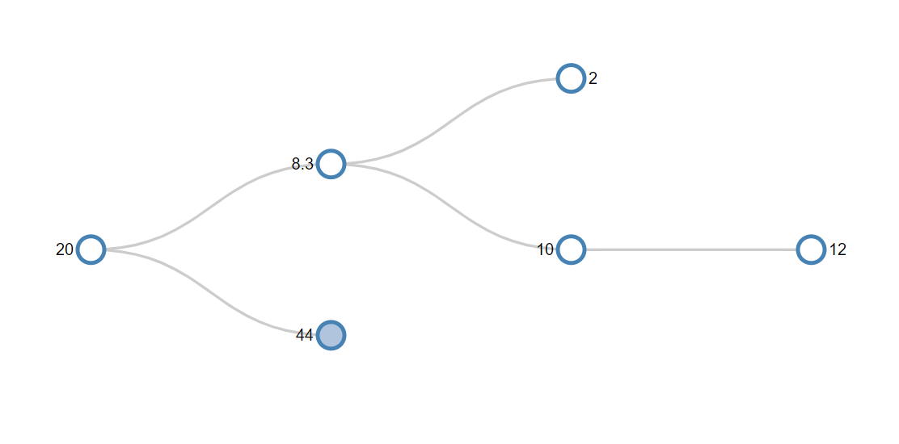

# AVL Tree Visualization with Flask

This project is a web-based visualization tool for AVL trees, implemented using Flask and D3.js. It allows users to enter a series of numbers, which are then organized into a self-balancing AVL tree and displayed graphically.

## Features

- Interactive AVL tree visualization
- Real-time insertion and balancing of the AVL tree
- Responsive design for various screen sizes

## Installation

To run this project locally, you'll need to have Python and Node.js installed. Follow these steps to get started:

1. Clone the repository:
`git clone git@github.com:David-Rodden/AVL.git`

2. Navigate to the project directory:
`cd AVL`

3. Install the required Python dependencies:
`pip install -r requirements.txt`

4. Install the required Node.js packages:
npm install

## Usage

To start the Flask application, run:
`flask run`

Open your web browser and navigate to `http://localhost:5000` to view the application.

## Contributing

Contributions are welcome! Feel free to fork this repository and submit a pull request.

## License

This project is open-source and available under the [MIT License](LICENSE).

## Visual Representation

Below is an example of what the AVL tree visualization looks like:

_The actual visualization will depend on the input provided. Clicking on a node will collapse or expand any children node that exist._

## Acknowledgments

- This project uses [D3.js](https://d3js.org) for rendering the AVL trees.
- [Flask](https://flask.palletsprojects.com/) is used as the web framework.

Thank you for checking out this project!